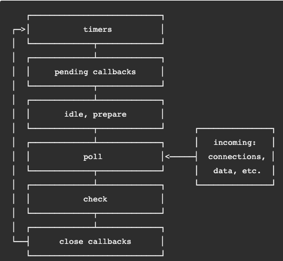
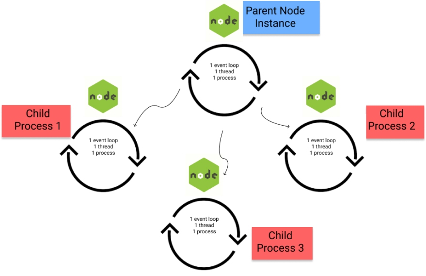
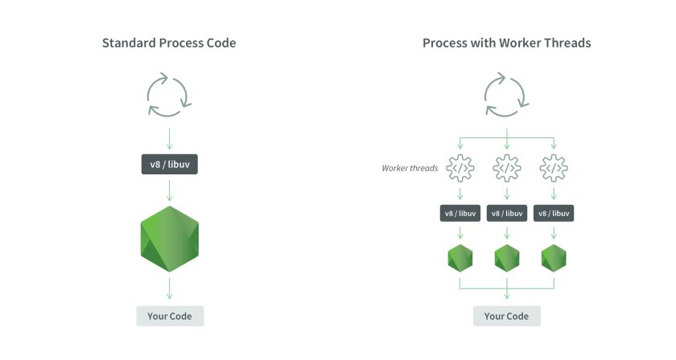

# Node.js

## The Event Loop

From Node.js docs:
  > *Each phase has a FIFO queue of callbacks to execute. While each phase is special in its own way,
  > generally, when the event loop enters a given phase, it will perform any operations specific to that phase,
  > then execute callbacks in that phase's queue until the queue has been exhausted or the maximum number of callbacks has executed.
  > When the queue has been exhausted or the callback limit is reached, the event loop will move to the next phase, and so on.*

## Handling Sync Operations

### Child processes

* The `child_process` module allows spawning child processes by accessing OS commands
  * This spins off new instances of Node, with each instance having:
    - 1 process
    - 1 thread
    - 1 event loop
* From Node.js docs:
  > *Keep in mind that spawned Node.js child processes are independent of the parent with exception of the IPC communication channel that is established between the two.
  > Each process has its own memory, with their own V8 instances.
  > Because of the additional resource allocations required, spawning a large number of child Node.js processes is not recommended.*
* Because memory is not shared, the risk in multithreaded languages of threads modifying the same variable is eliminated.
  * Without shared memory, though, forked processes consume lots of system memory
* Forked processes can only process one task at a time
* If a task crashes a child process, all other tasks sent to that process will be left incomplete

* worker-farm
  * Creates a pool of processes that can be reused to execute one task at a time
  * Can be complex to implement and still resource-intensive compared to a multithreaded solution

### Worker Threads

* The `worker_thread` module
  - 1 process
  - Multiple threads
  - 1 event loop *per thread*
* Have isolated contexts and exchange information with main process through messages
* They live in the same process as each other, so they use a lot less memory than child processes
* You can share memory with Worker threads by passing `SharedArrayBuffer` objects that are specifically meant for doing just that
  * Should only be used when necessary (e.g., to avoid serialization of data)
* It's still recommended to create a pool of worker threads

## Sources/Further Reading
* [Node.js docs - the event loop](https://nodejs.org/en/docs/guides/event-loop-timers-and-nexttick/)
* [Node.js docs - child_process](https://nodejs.org/api/child_process.html)
* [Node.js docs - worker_threads](https://nodejs.org/api/worker_threads.html)
* [Node.js multithreading - LogRocket](https://blog.logrocket.com/node-js-multithreading-what-are-worker-threads-and-why-do-they-matter-48ab102f8b10/)
* [Exploring Node.js worker_thread API](https://www.telerik.com/blogs/exploring-the-worker-thread-api-in-node)
* [Hands-on guide to event loop, child processes, and worker threads in Node.js](https://blog.soshace.com/advanced-node-js-a-hands-on-guide-to-event-loop-child-process-and-worker-threads-in-node-js/)
* [Worker pool implementation for Node.js](https://www.npmjs.com/package/workerpool)

